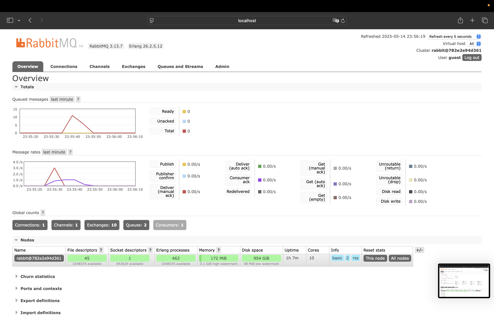
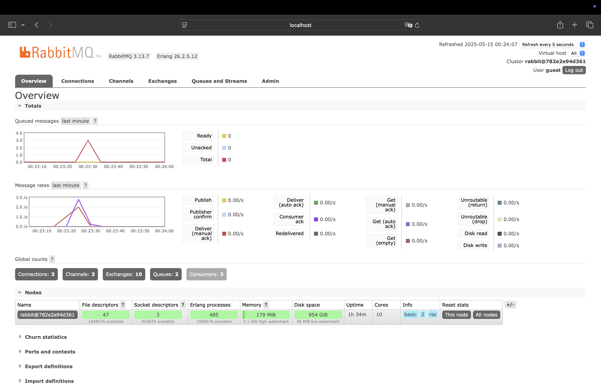

1. What is amqp?

   AMQP which stands for Advanced Message Queuing Protocol is an open standard protocol for message-oriented middleware. t allows applications to communicate with each other by sending messages through a broker in a reliable, secure, and asynchronous manner. AMQP ensures that messages are properly formatted, routed, queued, and delivered.

2. What does it mean? guest:guest@localhost:5672 , what is the first guest, and what is the second guest, and what is localhost:5672 is for?

    - The first `guest` is the username used to authenticate to the RabbitMQ server.
    - The second `guest` is the password for the username.
    - `localhost:5672` specifies the address and port of the RabbitMQ server. `localhost` means the server is running on the same machine. `5672` is the default port number used by RabbitMQ for AMQP protocol communication.

### Simulation Slow Subscriber

The total number of queued messages is around 11, which reflects the number of messages waiting to be consumed due to the delay in the subscriber. This happens because the producer keeps sending messages at a normal speed, while the slow subscriber processes them one by one, causing the queue to grow.

### Running at least three subscribers

As seen in the RabbitMQ dashboard, the spike in the message queue decreased much faster compared to the earlier simulation with only one subscriber (It now has 3 messages in the queue). This happened because the three subscriber instances processed messages in parallel, allowing the queued messages to be consumed more quickly. This shows that by adding more subscribers the system can handle the same publisher load more efficiently, preventing the queue from growing too long.